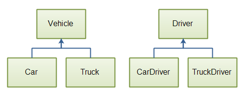

# Interface

A _Java_ _interface_ is a bit like a [Java class](https://jenkov.com/tutorials/java/classes.html), except a Java interface can only contain method signatures and fields. A Java interface is not intended to contain implementations of the methods, only the signature (name, parameters and exceptions) of the method. However, it is **possible to provide default implementations of a method** in a Java interface


```java
public interface MyInterface {

    public String hello = "Hello";
    public void sayHello();
}

public class MyInterfaceImpl implements MyInterface {

    public void sayHello() {
        System.out.println(MyInterface.hello);
    }
}
```

### Interface Intances

```java
MyInterface myInterface = new MyInterfaceImpl();

myInterface.sayHello();
```

### Implement Multiple Interfaces


```java
import com.jenkov.package1.MyInterface;
import com.jenkov.package2.MyOtherInterface;

public class MyInterfaceImpl implements MyInterface, MyOtherInterface {
    ...
}
```

### Overlapping Method Signatures

If a Java class implements multiple Java interfaces, there is a risk that some of these interfaces may contain methods with the same signature (name + parameters). Since a Java class can only implement at method with a given signature once, this could potentially lead to some problems.

The Java specification does not give any solution to this problem. It is up to you to decide what to do in that situation.

### Constants

All variables in an interface are implicitly `public`, `static` and `final`, even if you leave out these keywords in the variable declaration.


```java
public interface MyInterface {

    int FALSE = 0;
    int TRUE  = 1;
}
```

### Default Methods

Java 8 has added the concept of _interface default methods_ to Java interfaces. An interface default method can contain a default implementation of that method. Classes that implement the interface but which contain no implementation for the default interface will then automatically get the default method implementation. This is to avoid breaking changes when an interface is used by multiple clients and the owner decides to add a method to the interface which will break all other concrete class which are not implementing the new method

### Inheritance

It is possible for a Java interface to inherit from another Java interface, just like classes can inherit from other classes. You specify inheritance using the `extends` keyword.

the class which implement the subinterface has to implement all methods defined in both `SubInterface` and `SuperInterface`.

### Polymorphism

Java interfaces are a way to achieve polymorphism.

Example:



Now imagine you needed to be able to store these objects in a database, and also serialize them to XML, JSON, or other formats. You want that implemented using a single method for each operation, available on each `Car`, `Truck` or `Vehicle` object. A `store()` method, a `serializeToXML()` method and a `serializeToJSON()` method


One way to solve this problem would be to create a common superclass for the `Vehicle` and `Driver` class, which has the storage and serialization methods. However, this would result in a conceptual mes

A better solution would be to create some interfaces with the storage and serialization methods on, and let the classes implement these interfaces.


```java
public interface Storable {
    public void store();
}
public interface Serializable {
    public void serializeToXML(Writer writer);
    public void serializeToJSON(Writer writer);
}
```

When each class implements these two interfaces and their methods, you can access the methods of these interfaces by casting the objects to instances of the interface types

```java
Car car = new Car();

Storable storable = (Storable) car;
storable.store();

Serializable serializable = (Serializable) car;
serializable.serializeToXML (new FileWriter("car.xml"));
serializable.serializeToJSON(new FileWriter("car.json"));
```

#### Why upcast to interfaces

```java
// upcasting to interface
List<String> strings = new ArrayList<String>();

// as is
ArrayList<String> strings = new ArrayList<String>();

```

upcasting to List helps us restrict strings object to use only the behaviour supported by List interfaces and we can swap out ArrayList to any other class which implements List interface. At runtime strings is still treated as ArrayList but at compile time it is treated as List

### Generic Interfaces

A generic Java interface is an interface which can be typed - meaning it can be specialized to work with a specific type

```java
// generic interface
public interface MyProducer() {
    public Object produce();
}

// use it with car object
public class CarProducer implements MyProducer{
    public Object produce() {
        return new Car();
    }
}

MyProducer carProducer = new CarProducer();
Car car = (Car) carProducer.produce(); // cast the generic type to Car
```

#### Java Generics


```java
public interface MyProducer <T>{    
    public T produce();    
}

public class CarProducer<T> implements MyProducer<T>{

    @Override
    public T produce() {
        return (T) new Car();
    }

MyProducer<Car> myCarProducer = new CarProducer<Car>();
Car produce = myCarProducer.produce();

// since it is generic we can use any type
MyProducer<String> myStringProducer = new CarProducer<String>();
String produce1 = myStringProducer.produce();
```
